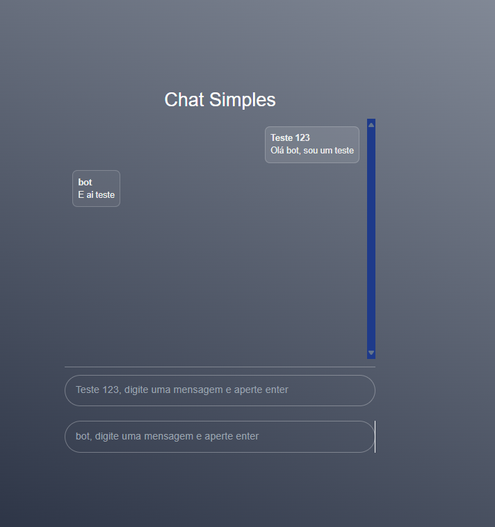

<h1 align="center">
  💬 Chat Simples 🗨️
</h1>


---

<p align="center">
  
</p>

---

# Indice

- 🚀 [Sobre o Projeto](#-sobre-o-projeto)
- 👨‍💻️ [Tecnogias utilizadas](#%EF%B8%8F-tecnogias-utilizadas)
- 📦️ [Como utilizar o projeto](#%EF%B8%8F-como-utilizar-o-projeto)

---

## 🚀 Sobre o Projeto

Este projeto é parte da conclusão do módulo de React do curso da B7Web, ministrado pelo professor Bonieky Lacerda. O objetivo do projeto é consolidar os conceitos aprendidos no curso, implementando uma aplicação funcional com React e outras ferramentas modernas do ecossistema.

### Objetivo do Projeto

O projeto consiste em uma simulação de chat virtual, onde o usuário pode interagir com um bot que responde automaticamente às mensagens enviadas. A aplicação é construída com Next.js, React, TailwindCSS e TypeScript, aproveitando as melhores práticas e funcionalidades dessas tecnologias.

---

## 👨‍💻️ Tecnogias utilizadas

O projeto foi desenvolvido utilizando as seguintes tecnologias:

- [Next](https://nextjs.org/docs)
- [React](https://react.dev/learn)
- [Tailwindcss](https://tailwindcss.com/docs/installation)
- [Typescript](https://www.typescriptlang.org/docs/)

### Dependências

- [tailwind-scrollbar](https://www.npmjs.com/package/tailwind-scrollbar)

### Padronização de código

- [ESLint](https://eslint.org/)
- [Prettier](https://prettier.io/)
- :mouse: [Editor Config](https://editorconfig.org/)

### IDE

- [Visual Studio Code](https://code.visualstudio.com/)

---

## 📦️ Como utilizar o projeto

Para copiar o projeto, utilize os comandos:

```bash
  ❯ git clone https://github.com/Gabriel4420/chat-simples-b7web.git
```

Para instalar as dependências e iniciar o projeto, você pode utilizar o flutter ou pub:

### Utilizando npm

```bash
  # instala as dependências
  ❯ npm i

```

<h4 align="center">
  Feito com ❤️ por Gabriel Rodrigues 👋️ <a href="mailto:gabriel_rodrigues_perez@hotmail.com">Entre em contato!</a>
</h4>

<p align="center">

  <a href="https://www.linkedin.com/in/gabriel-rodrigues-perez-2069b072/">
    
  </a>
  <a href="https://www.facebook.com/gabriel.rodrigues.perez">
    
  </a>
  <a href="https://www.instagram.com/gabriel_rodrigues_perez/">
    
  </a>
  
</p>
